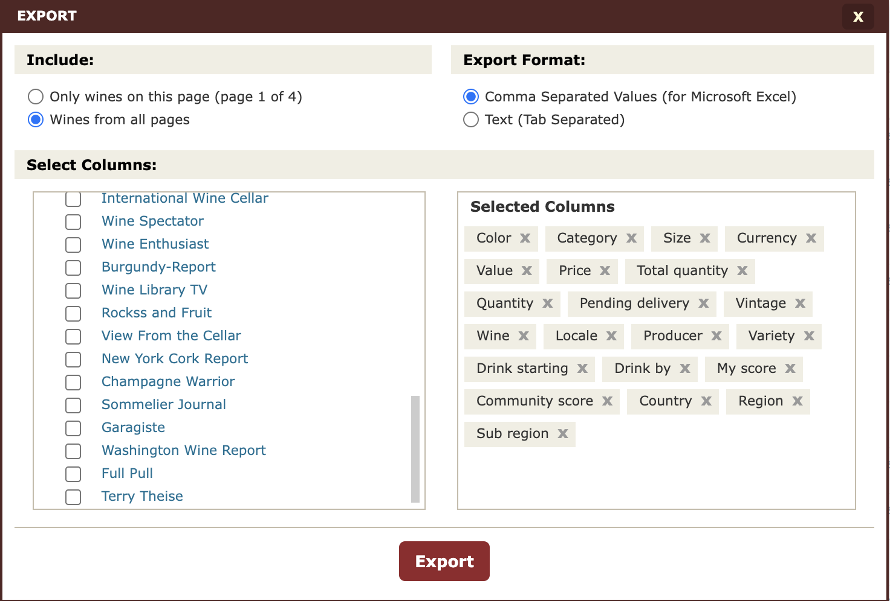

# WineBuddy

A wine cellar database application that enables you to query the wines in your
cellar.

## Installation

### Try without installing

```bash
# From local directory
uvx --from . winebuddy --help
```

```bash
# Install from local directory
uv tool install .
```

Once installed, run the tool directly:

```bash
winebuddy --help
```

### Uninstall

```bash
uv tool uninstall winebuddy
```

## Setup

First, you need the data. The recommended way is to build your cellar using [CellarTracker](https://mobileapp.cellartracker.com), then export using their website to generate a CSV file as follows:



Make sure you include wines from all pages, you generate a Comma Separated
Values for the Export Format, and you select precisely the columns shown above.
Make sure the file exported is named cellar.csv and is moved to the current
directory.

The database will automatically get created when you call `winebuddy`.

## Querying Your Cellar

Use `winebuddy` to search and filter wines from your cellar.

```bash
winebuddy [OPTIONS]
```

### Filter Options

| Option | Short | Description |
|--------|-------|-------------|
| `--color` | `-c` | Filter by wine color (Red, White, Rosé, etc.) |
| `--producer` | `-p` | Filter by producer (partial match) |
| `--varietal` | `-v` | Filter by varietal (partial match) |
| `--country` | | Filter by country (exact match) |
| `--region` | `-r` | Filter by region (partial match) |
| `--vintage` | | Filter by exact vintage year |
| `--vintage-min` | | Minimum vintage year |
| `--vintage-max` | | Maximum vintage year |
| `--score-min` | | Minimum professional score |
| `--in-stock` | | Only show wines with quantity > 0 |
| `--ready` | | Only show wines within their drinking window |

### Output Options

| Option | Short | Description |
|--------|-------|-------------|
| `--sort` | `-s` | Sort by: `vintage`, `producer`, `score`, `value`, `name` |
| `--desc` | `-d` | Sort in descending order |
| `--limit` | `-l` | Limit number of results |
| `--format` | `-f` | Output format: `table`, `json`, `csv` |

## Examples

### Basic Queries

```bash
# List all wines
winebuddy

# List all red wines
winebuddy --color Red

# List all wines from a specific producer
winebuddy --producer "Château"

# List all Pinot Noir wines
winebuddy --varietal "Pinot Noir"
```

### Vintage Filters

```bash
# Wines from exactly 2015
winebuddy --vintage 2015

# Wines from 2015 or older
winebuddy --vintage-max 2015

# Wines from 2018 or newer
winebuddy --vintage-min 2018

# Wines between 2010 and 2015
winebuddy --vintage-min 2010 --vintage-max 2015
```

### Location Filters

```bash
# Wines from France
winebuddy --country France

# Wines from Burgundy region
winebuddy --region Burgundy

# California Cabernet Sauvignon
winebuddy --region California --varietal "Cabernet Sauvignon"
```

### Stock and Drinking Window

```bash
# Only wines currently in stock
winebuddy --in-stock

# Wines ready to drink now
winebuddy --ready

# Red wines in stock that are ready to drink
winebuddy --color Red --in-stock --ready
```

### Sorting Results

```bash
# Sort by vintage (oldest first)
winebuddy --sort vintage

# Sort by vintage (newest first)
winebuddy --sort vintage --desc

# Sort by professional score (highest first)
winebuddy --sort score --desc

# Sort by value (most expensive first)
winebuddy --sort value --desc

# Top 10 highest-scored wines
winebuddy --sort score --desc --limit 10
```

### Output Formats

#### Table (default)

```bash
winebuddy --limit 5
```

```
Vintage | Wine Name                    | Producer        | Varietal   | Region     | Qty | Score
--------+------------------------------+-----------------+------------+------------+-----+------
NV      | Billecart-Salmon Brut Rosé   | Billecart-Salmon| Champagne  | Champagne  | 8   | -
2015    | Château Margaux              | Château Margaux | Bordeaux   | Bordeaux   | 2   | 98.0
...

5 wine(s) found.
```

#### JSON

```bash
winebuddy --format json --limit 2
```

```json
[
  {
    "id": 1,
    "wine_name": "Billecart-Salmon Champagne Brut Rosé",
    "vintage": null,
    "producer": "Billecart-Salmon",
    "varietal": "Champagne Blend",
    "color": "Rosé",
    "country": "France",
    "region": "Champagne",
    "subregion": null,
    "quantity": 8,
    "value": 89.99,
    "professional_score": null,
    "begin_consume": 2020,
    "end_consume": 2025
  }
]
```

#### CSV

```bash
winebuddy --format csv --limit 2
```

```csv
id,wine_name,vintage,producer,varietal,color,country,region,subregion,quantity,value,professional_score,begin_consume,end_consume
1,Billecart-Salmon Champagne Brut Rosé,,Billecart-Salmon,Champagne Blend,Rosé,France,Champagne,,8,89.99,,2020,2025
```

Export to a file:

```bash
winebuddy --format csv > my_wines.csv
```

### Combined Examples

```bash
# French red wines from 2015 or older, sorted by score
winebuddy --country France --color Red --vintage-max 2015 --sort score --desc

# Top 5 most valuable wines in stock
winebuddy --in-stock --sort value --desc --limit 5

# All Champagne ready to drink, as JSON
winebuddy --region Champagne --ready --format json

# Italian wines with score >= 90
winebuddy --country Italy --score-min 90
```

## Database Schema

The `wines` table contains:

- **color**: Red, White, Rosé, etc.
- **category**: Still, Sparkling, etc.
- **vintage**: Year (NULL for non-vintage wines)
- **wine_name**, **producer**, **varietal**
- **country**, **region**, **subregion**, **locale**
- **quantity**: Bottles currently in cellar
- **value**, **price**, **currency**
- **begin_consume**, **end_consume**: Drinking window (9999 = unknown)
- **professional_score**, **community_score**
